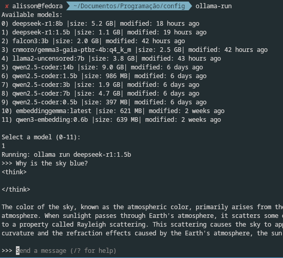

# Ollama-run

Just a small .sh that displays a menu to choose which local Large Language Model (LLM) will be run at the time.
The ollama-run makes running local ollama models more straightforward.

## Usage

Just run `ollama-run`. It will start ollama server (if not started yet) and display the available models to choose, and run it:

```bash
$ ollama-run qwen3                                                                  ✔ 
Error: ollama server not responding - could not connect to ollama server, run 'ollama serve' to start it
== Starting ollama server in backgroud ==
--------------------
Only one model found with "qwen3".
Running: qwen3:0.6b
⠦ 
```

listing all available models:

```bash
$ ollama-run                                                                   ✔ 
= Ollama is running =
--------------------
Available models:
1) gemma3:latest | size: 3.3 GB | modified: 3 months ago
2) granite-embedding:278m | size: 562 MB | modified: 4 months ago
3) cnmoro/gemma3-gaia-ptbr-4b:q8_0 | size: 4.1 GB | modified: 4 months ago
4) qwen3:0.6b | size: 522 MB | modified: 5 months ago
5) qwen2.5-coder:7b | size: 4.7 GB | modified: 5 months ago
6) qwen2.5-coder:14b | size: 9.0 GB | modified: 5 months ago
7) codellama:7b | size: 3.8 GB | modified: 5 months ago
8) deepseek-r1:14b | size: 9.0 GB | modified: 5 months ago

Select a model (1-8):
(Press ctrl+c to cancel)
```

<!--  -->

It is possible to quickly filter (it uses grep) the models by typing a name or part of it. For example, if you type `qwen`, it will display only the models that contain the word `qwen`.

```bash
$ ollama-run qwen

= Ollama is running =
--------------------
Available models:
1) qwen3:0.6b | size: 522 MB | modified: 5 months ago
2) qwen2.5-coder:7b | size: 4.7 GB | modified: 5 months ago
3) qwen2.5-coder:14b | size: 9.0 GB | modified: 5 months ago

Select a model (1-3):
(Press ctrl+c to cancel)
```

Providing the complete name, it will run it like normal `ollama run <model-name>`

```bash
$ ollama-run qwen2.5-coder:0.5b
= Ollama is running =
--------------------
running: qwen2.5-coder:0.5b
⠦ 
```

Providing part of the model name, and if only one model exists with that, then this only option will run.

```bash
$ ollama-run gaia
= Ollama is running =
--------------------
Only one model found with "gaia"
running: cnmoro/gemma3-gaia-ptbr-4b:q4_k_m
⠦ 
```

## Installation Steps

1) Save it in your computer
2) give it running permission with `chmod +x ollama_run`
3) add to your PATH env

```bash
# download the file
wget https://raw.githubusercontent.com/SoaresAlisson/ollama-run/refs/heads/main/ollama-run

# Create a local bin directory (if it doesn't exist):
mkdir -p ~/.local/bin

# Move the script to this directory:
mv ollama-run ~/.local/bin/ollama-run

# Make it executable
chmod +x ~/.local/bin/ollama-run

# Add the directory to your PATH 
export PATH="$HOME/.local/bin:$PATH"

# Reload your shell configuration:
## for bash:
source ~/.bashrc  
# or for zsh 
source ~/.zshrc

```

Now you can run ollama-run from anywhere
